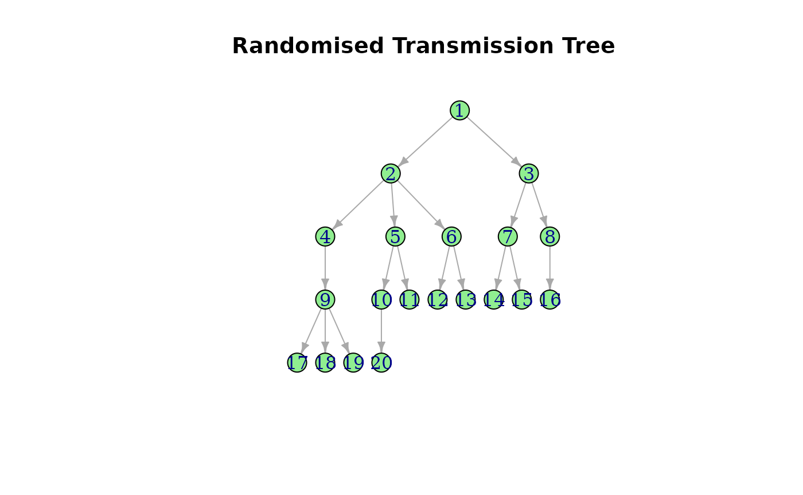

# mixtree

## Introduction

The `mixtree` package provides a statistical framework for comparing
sets of trees (“forests”). The function
[`tree_test()`](https://cygei.github.io/epitree/reference/tree_test.md),
can apply various hypothesis testing approaches to assess differences
between forests. While currently supporting transmission trees, future
updates will expand functionality to include phylogenetic trees and,
graphs more generally.

## Methods

The $\chi^{2}$ test compares the absolute frequencies of edges between
forests. PERMANOVA compares the overall topological structure of trees
between forests based on pairwise distances.

Both methods test the null hypothesis that the forests are drawn from
the same generative process.

## Input Requirements

Each input set must be a list of data frames. Every data frame
represents a tree and must contain exactly two columns:

- `from`: The parent node.

- `to`: The child node.

`make_tree` is a helper function that simulates a DAG with the number of
branches per node drawn from a Poisson distribution with $\lambda$ = `R`
when `stochastic = TRUE`

``` r
library(mixtree)
make_tree(20, R = 2, stochastic = TRUE, plot = TRUE)
```



    #> IGRAPH c24c754 D--- 20 19 -- 
    #> + edges from c24c754:
    #>  [1]  1-> 2  1-> 3  2-> 4  2-> 5  2-> 6  3-> 7  3-> 8  4-> 9  5->10  5->11
    #> [11]  6->12  6->13  7->14  7->15  8->16  9->17  9->18  9->19 10->20

## Usage

The unified interface is provided by the
[`tree_test()`](https://cygei.github.io/epitree/reference/tree_test.md)
function. Users can supply two or more sets of trees and select the
desired testing method via the `method` parameter.

### PERMANOVA

``` r
set.seed(123)
# Generate 100 trees with R₀ = 2
chainA <- lapply(1:100, function(i){
  make_tree(20, R = 2, stochastic = TRUE) |>
    igraph::as_long_data_frame()
})

# Generate 100 trees with R₀ = 4
chainB <- lapply(1:100, function(i){
  make_tree(20, R = 4, stochastic = TRUE) |>
     igraph::as_long_data_frame()
})

tree_test(chainA, chainB, method = "permanova")
#> Permutation test for adonis under reduced model
#> Permutation: free
#> Number of permutations: 999
#> 
#> (function (formula, data, permutations = 999, method = "bray", sqrt.dist = FALSE, add = FALSE, by = NULL, parallel = getOption("mc.cores"), na.action = na.fail, strata = NULL, ...) 
#>           Df SumOfSqs      R2      F Pr(>F)    
#> Model      1     8052 0.14429 33.388  0.001 ***
#> Residual 198    47750 0.85571                  
#> Total    199    55802 1.00000                  
#> ---
#> Signif. codes:  0 '***' 0.001 '**' 0.01 '*' 0.05 '.' 0.1 ' ' 1
```

The p-value is below the 5% significance level, we reject the null
hypothesis of no difference.

### Chi-Square Test

``` r
tree_test(chainA, chainB, method = "chisq", test_args = list(simulate.p.value = TRUE, B = 999))
#> 
#>  Pearson's Chi-squared test with simulated p-value (based on 999
#>  replicates)
#> 
#> data:  count data
#> X-squared = 1791.2, df = NA, p-value = 0.001
```

## Advanced Usage

The
[`tree_test()`](https://cygei.github.io/epitree/reference/tree_test.md)
function accepts additional parameters to customise the testing process:

- `within_dist`: A function to compute pairwise distances within a tree
  (used with PERMANOVA). Default is
  [`patristic()`](https://cygei.github.io/epitree/reference/patristic.md).

- `between_dist`: A function to compute the distance between two trees
  (used with PERMANOVA). Default is
  [`euclidean()`](https://cygei.github.io/epitree/reference/euclidean.md).

- `test_args`: A list of extra arguments passed to the underlying test
  function
  (i.e. [`vegan::adonis2`](https://vegandevs.github.io/vegan/reference/adonis.html),[`stats::chisq.test`](https://rdrr.io/r/stats/chisq.test.html),
  or [`stats::fisher.test`](https://rdrr.io/r/stats/fisher.test.html)).

### Using Custom Distance Functions

The package supports custom distance functions, such as the MRCI depth
measure described in [Kendall *et
al.*(2018)](https://projecteuclid.org/journals/statistical-science/volume-33/issue-1/Estimating-Transmission-from-Genetic-and-Epidemiological-Data--A-Metric/10.1214/17-STS637.full).
See also the
[vignette](https://thibautjombart.github.io/treespace/articles/TransmissionTreesVignette.html)
from `treespace`.

``` r
library(treespace)
mrciDepth <- function(tree) {
 treespace::findMRCIs(as.matrix(tree))$mrciDepths
}
tree_test(chainA, chainB, within_dist = mrciDepth)
```

#### Note

Randomly shuffling node IDs will not affect the PERMANOVA test results
if the distance functions are invariant to node labelling
(e.g. [`patristic()`](https://cygei.github.io/epitree/reference/patristic.md)).
However, if a custom function depends on the order or specific labels of
nodes, then shuffling could influence the results
(e.g. [`treespace::findMRCIs`](https://rdrr.io/pkg/treespace/man/findMRCIs.html)).

``` r
chainA <- lapply(1:50, function(i) {
  make_tree(20, R = 2, stochastic = TRUE)
})
chainB <- lapply(1:50, function(i) {
  df <- mixtree:::shuffle_graph_ids(chainA[[i]]) |>
    igraph::as_long_data_frame()
  subset(df, select = c("from", "to"))
})
chainA <- lapply(chainA, igraph::as_long_data_frame)
  
tree_test(chainA, chainB, method = "permanova")
#> Permutation test for adonis under reduced model
#> Permutation: free
#> Number of permutations: 999
#> 
#> (function (formula, data, permutations = 999, method = "bray", sqrt.dist = FALSE, add = FALSE, by = NULL, parallel = getOption("mc.cores"), na.action = na.fail, strata = NULL, ...) 
#>          Df SumOfSqs R2  F Pr(>F)
#> Model     1        0  0  0      1
#> Residual 98    32796  1          
#> Total    99    32796  1

# In contrast, the Chi-Square test will reject the null as it compare edge frequencies
tree_test(chainA, chainB, method = "chisq")
#> 
#>  Pearson's Chi-squared test
#> 
#> data:  count data
#> X-squared = 849.55, df = 193, p-value < 2.2e-16
```

## Future Developments

While the current implementation focuses on transmission trees, the
package is designed with extensibility in mind. Future versions will
support phylogenetic trees and graphs more generally.
